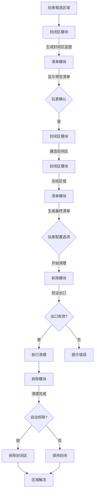
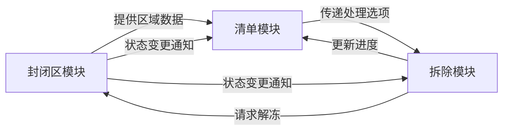

# 缺氧Mod功能描述：封闭施工_清理系统（三模块设计）

## 模块划分
### 1. 封闭区模块 (Containment Field)
#### 核心功能：
- **区域冻结**：
  - 完全包裹选定区域形成封闭空间
  - 激活时冻结内部所有状态（气体/液体/固体/建筑）
  - 暂停物理反应、化学反应和生物活动

- **视觉表现**：
  - 组合贴图覆盖在建筑/液体/气体上层
  - 状态指示：
    - 建造中：亮蓝色半透明框架+建造进度
    - 已冻结：灰色半透明+"已冻结"标识
    - 清理中：绿色进度条+当前操作提示

- **边界管理**：
  - 自动计算最小封闭边界
  - 确保完全气密性结构
  - 支持跨高度层封闭

### 2. 拆除模块 (Demolition System)
#### 核心功能：
- **清理执行**：
  - 按固定顺序处理：
    1. 固体拆除（建筑→矿石→杂物）
    2. 气体收集
    3. 液体收集
  - 实时进度跟踪与更新

- **资源处理**：
  - 建筑拆除：100%材料返还
  - 矿石挖掘：完整资源收集
  - 气体/液体：自动罐装处理
  - 杂物：完全回收

- **出口管理**：
  - 自动定位出口（选区起点外侧1格）
  - 验证出口可用性（无实体阻挡）
  - 资源运输路径管理

- **封闭区拆除**：
  - 可选自动拆除（100%材料回收）
  - 顺序拆除屏障块
  - 区域解冻功能

### 3. 清单模块 (Checklist System)
#### 核心功能：
- **清单生成**：
  - 预览清单（建造阶段）：简略统计
  - 最终清单（冻结后）：精确扫描所有物体
  - 分类统计：建筑/矿石/液体/气体/杂物

- **选项管理**：
  - 处理选项配置：
    ```markdown
    | 类别   | 选项                |
    |--------|---------------------|
    | 液体   | □ 收集罐装   |
    | 气体   | □ 收集罐装    |
    | 建筑   | □ 拆除       |
    | 矿石   | □ 挖掘       |
    | 杂物   | □ 清理        |
    | 封闭区 | □ 自动拆除          |
    ```
  - 选项锁定机制（施工开始后不可更改）

- **UI交互**：
  - 清单窗口显示（点击封闭区触发）
  - 实时进度更新
  - 出口状态显示（有效/无效）

## 系统工作流程



## 模块交互关系



## 关键特性说明

### 封闭区模块特性
1. **冻结机制**：
   - 使用游戏时间暂停API实现状态冻结
   - 独立于游戏全局时间系统
   - 恢复时无缝衔接

2. **视觉层级**：
   - 渲染层级：建筑层 < 液体层 < 气体层 < 封闭区覆盖层
   - 透明度控制：建造中(30%) → 冻结(70%) → 清理中(50%+进度条)

### 拆除模块特性
1. **智能拆除顺序**：
   - 建筑：从顶部向下拆除
   - 矿石：按价值优先级
   - 管道系统：先内容物后管道

2. **罐装处理**：
   - 气体→压缩气罐
   - 液体→液体罐
   - 自动匹配容器类型

### 清单模块特性
1. **动态清单**：
   ```mermaid
   graph LR
    扫描开始 --> 分类统计 --> 生成UI --> 选项配置 --> 施工更新
   ```
2. **异常处理**：
   - 出口阻塞提示
   - 施工中断恢复
   - 资源冲突预警

## 优势设计
1. **模块独立性**：
   - 封闭区：专注冻结/视觉
   - 拆除模块：专注清理逻辑
   - 清单模块：专注数据/UI

2. **性能优化**：
   - 冻结状态减少物理计算
   - 按需扫描（非持续）
   - 批量处理气体/液体

3. **玩家体验**：
   - 一键式区域清理
   - 可视化进度反馈
   - 灵活处理选项
   - 安全冻结机制

此设计清晰划分三大核心模块，各司其职又协同工作，完整实现"封闭→冻结→清理"的核心功能，同时保持系统简洁性和可扩展性。